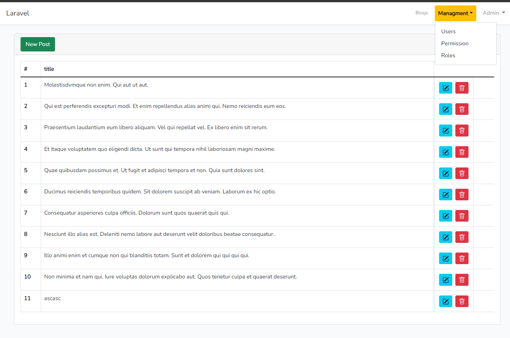
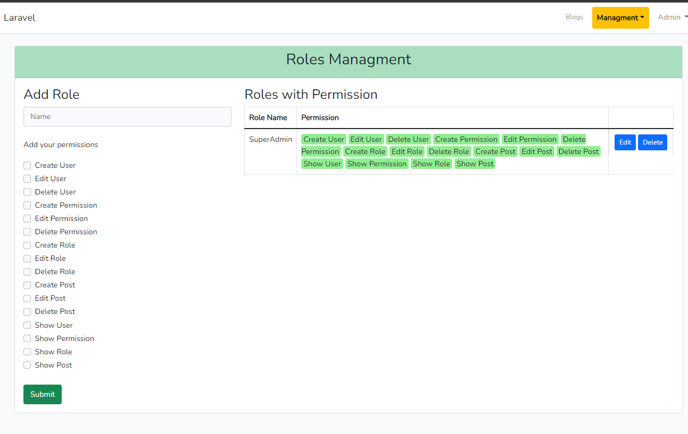

## Spatie Laravel Roles Permissions Sample (Boilerplate) 

This Project is only created for to learn [Spatie Laravel-permission package](https://github.com/spatie/laravel-permission) & also inspired from [Laravel Daily](https://laraveldaily.com)

- - - - -
**Model**
* Posts 
* Persmission
* Roles 
* Users 

Screenshot : 

Screenshot :

## Usage

- Clone the repository with `git clone`
- Copy `.env.example` file to `.env` and edit database credentials there
- Run `composer install`
- Run `php artisan key:generate`
- Run `php artisan migrate --seed` (it has some seeded data - see below)
- That's it: launch the main URL and login with default credentials `admin@admin.com` - `password`

With that user you can create more roles/permissions/users, and then use them in your code, by using functionality like `Gate` or `@can`, as in default Laravel, or with help of Spatie's package methods.

## License

The [MIT license](http://opensource.org/licenses/MIT).

## Notice
All the credit goes to [Spatie Laravel-permission package](https://github.com/spatie/laravel-permission). For proper guide, i would like to suggest direct follow the offical documentations.

